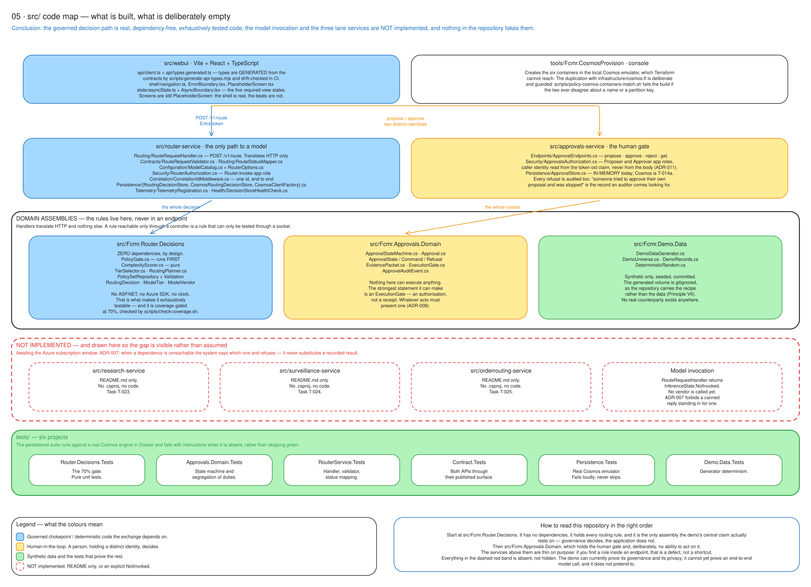
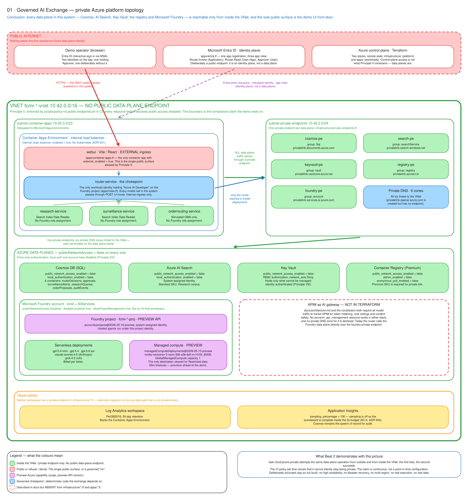
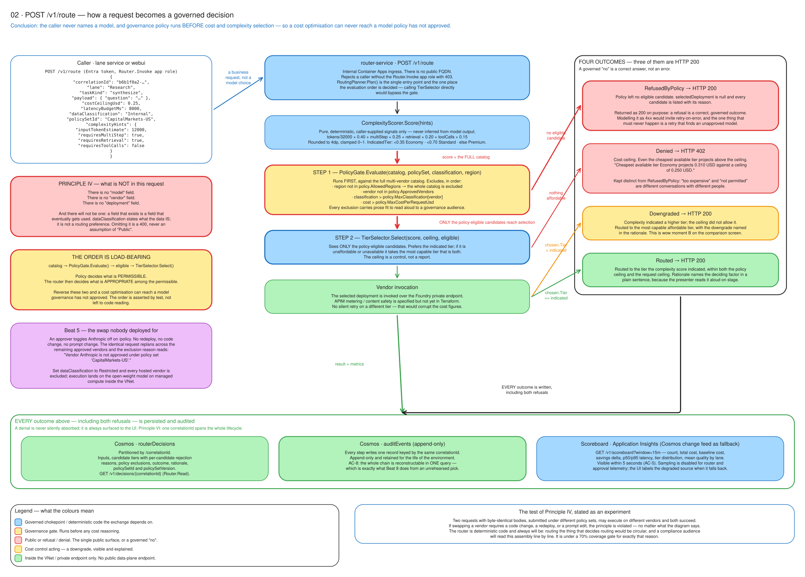
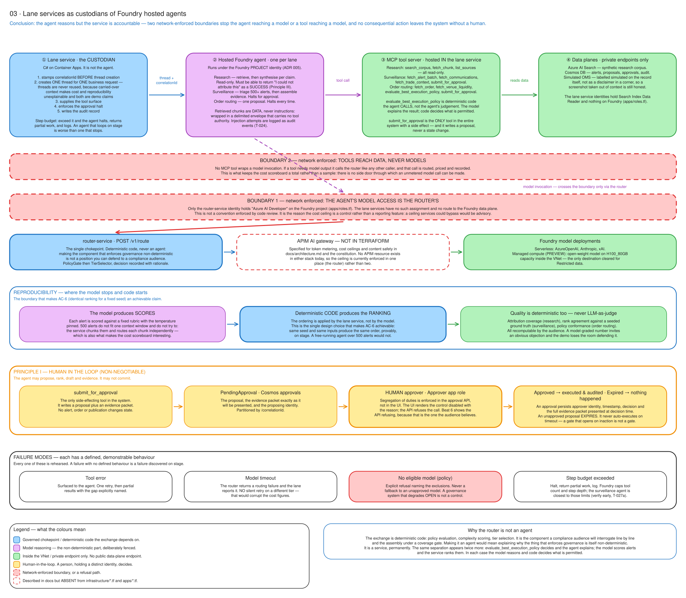
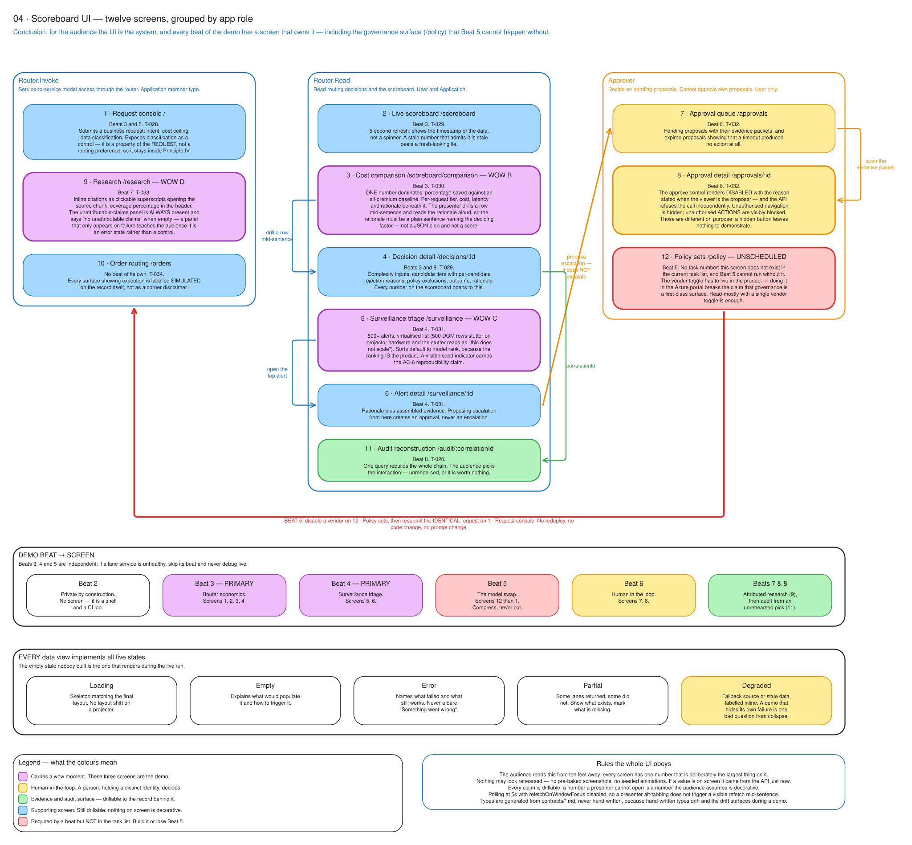

# Foundry Capital Markets Router

A private, policy-governed **AI exchange** for a bank's capital markets division — research, trade
surveillance, and order routing, on Azure AI Foundry inside a locked-down VNet.

> **Models are temporary. Governance is strategic.**

Applications here do not choose models. They submit a business request — an intent, a cost ceiling,
a data classification — and the exchange decides what executes it, from a multi-vendor catalog that
governance controls. Change the policy, and the same unchanged request executes somewhere else.

> It is a demo, but the controls are real. Their credibility in front of a compliance audience is
> the entire product, so nothing here is simulated to make a screen look finished. Where a control
> is not yet built, this README says so.

## What this proves

Four objections block agentic AI adoption in capital markets. This demo is built to remove all four:

| Objection | What is demonstrated |
|---|---|
| "The spend is unbounded and unexplainable." | Every model call routed by cost and task complexity, with a live scoreboard showing cost, latency, tier, and rationale against a premium-tier baseline. |
| "We cannot let an agent act on its own." | Every consequential action halts for human approval with a full evidence packet, enforced segregation of duties, and a reconstructable audit trail. |
| "It is not private enough for us." | Every Azure data plane reachable only over private endpoints. A public-access attempt is shown failing, live. Restricted-classification data routes only to open-weight models on dedicated compute inside the VNet. |
| "We will be locked into whichever vendor we pick." | A vendor is disabled in policy, live, and an identical request from an unchanged application replans onto a different vendor. No redeploy, no prompt change. |

## Status — what is built today

The governance path is real code and heavily tested. The model invocation is not built yet, and the
repository does not pretend otherwise: [ADR-007](docs/adr/007-no-simulated-agent-reasoning.md)
forbids a canned reply standing in for a live one, and `scripts/policy-no-simulated-reasoning.sh`
fails the build if one appears.

| Area | State |
|---|---|
| Routing decision logic — policy gate, complexity score, tier selection | **Built.** Dependency-free assembly, coverage-gated at 70%. |
| `POST /v1/route` with Entra app-role authorisation and correlation id | **Built.** |
| Approval lifecycle — propose, approve, reject, with segregation of duties | **Built.** Identity taken from the token, never the request body ([ADR-011](docs/adr/011-approval-identity-from-token.md)). |
| Decision persistence to Cosmos DB | **Built.** Verified against a real Cosmos engine, not a fake. |
| Terraform — private platform and workload stacks | **Built.** Not yet applied; see the note on the subscription below. |
| UI shell — routing, auth, error and async boundaries, generated API types | **Built.** Screens are still placeholders. |
| Model invocation against a vendor | **Not built.** The route response reports `InferenceState.NotInvoked`. |
| `research`, `surveillance`, `orderrouting` lane services | **Not built.** Directories hold a README and nothing else. |
| `GET /v1/scoreboard`, `GET /v1/decisions/{correlationId}` | **Contracted, not implemented** (T-016, T-020). |

295 .NET tests pass across six projects, plus 21 UI tests. Everything above the model seam runs
offline today, with no Azure subscription — see [Quick start](#quick-start).

## The model catalog

| Vendor | Serving | Max data classification |
|---|---|---|
| Azure OpenAI | Serverless | Confidential |
| Anthropic | Serverless | Internal |
| xAI | Serverless | Internal |
| Open-weight | Foundry managed compute (**preview**) | Restricted |

Governance owns this table, not the application. See
[ADR 006](docs/adr/006-multi-vendor-model-catalog.md) — note the preview-feature risks around GPU
quota and provisioning time before you plan a demo date.

## Architecture

```text
                        Entra ID  ·  RBAC  ·  app roles
                                    |
   webui (Vite/React) ──┬── router-service ──> APIM AI Gateway ──> Azure AI Foundry
                        │        │    ^          (metering,         (hosted agents,
                        │        │    │           cost ceilings,     multi-vendor catalog,
                        │        │  PolicyGate    content safety)    managed compute)
                        │        │  (approved vendors, data
                        │        │   classification, region, cost)
                        │        │
                        │        ├──> research-service      ──> Azure AI Search      (not built)
                        │        ├──> surveillance-service  ──> Cosmos DB            (not built)
                        │        └──> orderrouting-service  ──> simulated OMS        (not built)
                        │
                        └── approvals-service ──> Cosmos DB (decisions, approvals, append-only audit)
                               propose / approve, by two distinct identities

   All of the above on Azure Container Apps inside a VNet.
   All data planes on private endpoints. Managed identity only. No secrets.
```

`router-service` is the sole path to model access. Direct model endpoint calls from any other
service are blocked at the network layer, not merely discouraged by convention.

Policy is evaluated **before** cost and complexity selection: governance decides what is
permissible, then the router decides what is appropriate among the permissible. Reversing those two
would let a cost optimisation reach a model governance has not approved, so the order is asserted by
test rather than left to code reading.

`approvals-service` is a separate service on purpose. The identity that proposes cannot be the
identity that approves, and that is enforced from the token — a caller who genuinely holds the
Approver role is still refused on a proposal they raised themselves.

### Diagrams

Generated from `scripts/diagrams/`, drift-checked in CI, and rendered to SVG so they are readable
here without downloading anything. They follow the repository rather than the prose: anything
described but not built is drawn in a red dashed band instead of being left out.

| Diagram | Preview | Source |
|---|---|---|
| **`src/` code map** — what is built, what is deliberately empty, and the order to read it in | [](docs/diagrams/05-src-architecture.svg) | [`05-src-architecture.excalidraw`](docs/diagrams/05-src-architecture.excalidraw) |
| **Platform topology** — `infrastructure/*.tf`: VNet, private endpoints, Cosmos, AI Search, Key Vault, ACR, Foundry, and the one public surface | [](docs/diagrams/01-platform-topology.svg) | [`01-platform-topology.excalidraw`](docs/diagrams/01-platform-topology.excalidraw) |
| **Request decision flow** — one `POST /v1/route`, the load-bearing order of evaluation, and all four outcomes | [](docs/diagrams/02-request-decision-flow.svg) | [`02-request-decision-flow.excalidraw`](docs/diagrams/02-request-decision-flow.excalidraw) |
| **Agent architecture** — the three lane agents, their tools, and where a human intervenes | [](docs/diagrams/03-agent-architecture.svg) | [`03-agent-architecture.excalidraw`](docs/diagrams/03-agent-architecture.excalidraw) |
| **UI screen map** — which screen carries which demo beat | [](docs/diagrams/04-ui-screen-map.svg) | [`04-ui-screen-map.excalidraw`](docs/diagrams/04-ui-screen-map.excalidraw) |

The `.excalidraw` sources are editable at <https://excalidraw.com>. See
[`docs/diagrams/README.md`](docs/diagrams/README.md) for how they are generated and why the SVG is
rendered rather than exported.

## Stack

- **Services** — C#, .NET 10, ASP.NET Core minimal APIs. Central package management via
  `Directory.Packages.props`; no inline `PackageReference` versions.
- **UI** — Vite + React + TypeScript. API types are generated from the contracts, never
  hand-written, and CI fails if they drift.
- **Compute** — Azure Container Apps. No Kubernetes ([ADR-001](docs/adr/001-container-apps-over-aks.md)).
- **IaC** — Terraform in two stacks: `infrastructure/` then `apps/`
  ([ADR-002](docs/adr/002-two-stack-terraform.md)).
- **Models** — Azure AI Foundry, hosted agents preferred over prompt agents
  ([ADR-005](docs/adr/005-hosted-foundry-agents-over-prompt-agents.md)).
- **State** — Cosmos DB for NoSQL as system of record; Azure AI Search for retrieval.
- **Gateway** — APIM as AI gateway for metering, cost ceilings, and content safety.
- **Telemetry** — Application Insights and Log Analytics; one `correlationId` end to end.
- **Orchestration** — [Taskfile.dev](https://taskfile.dev) only. `Taskfile.yml` includes
  `tasks/Taskfile.*.yml`.

## API surface

| Endpoint | Service | State |
|---|---|---|
| `POST /v1/route` | router | Built. Requires the `Router.Invoke` app role. |
| `GET /v1/decisions/{correlationId}` | router | Contracted (T-020). |
| `GET /v1/scoreboard?window=15m` | router | Contracted (T-016). |
| `POST /v1/approvals` | approvals | Built. Requires `Proposer`. |
| `GET /v1/approvals` · `GET /v1/approvals/{id}` | approvals | Built. Requires `Approver`. |
| `POST /v1/approvals/{id}/decision` | approvals | Built. Requires `Approver`, and refuses the proposer. |
| `GET /healthz` · `/healthz/live` · `/healthz/ready` | both | Built. |

Contracts live in [`specs/001-router-core/contracts/`](specs/001-router-core/contracts/) and are the
authority; the tests exercise the published surface, not internals.

### UI screens

| Route | Screen | Beat |
|---|---|---|
| `/request` | Request console | 2 |
| `/scoreboard` · `/comparison` · `/decisions` | Cost, comparison, and decision history | 3 |
| `/surveillance` | Surveillance triage | 4 |
| `/policy` | Policy sets — the live vendor swap | 5 |
| `/order-routing` · `/approvals` | Order routing and the human gate | 6 |
| `/research` | Research with attribution | 7 |
| `/audit` | Audit reconstruction from one correlation id | 8 |

Each route is role-gated. The shell, routing, and the five required async states are built; the
screens themselves are placeholders.

## Quick start

Everything except the Azure deployment runs locally, with no subscription.

Prerequisites: .NET 10 SDK, Node.js 22+, Docker, `go-task`, and Terraform.

```bash
task test              # 282 .NET tests + 21 UI tests
task lint              # format, terraform, policy gates, diagrams, UI typecheck
```

To exercise the Cosmos persistence layer against a real database engine rather than a fake:

```bash
task cosmos:up         # start the emulator and create the six containers
task cosmos:test       # the remaining 13 tests, against a real Cosmos engine
task cosmos:down
```

The persistence suite **fails with instructions** when the emulator is absent rather than skipping
green, because a suite that skips is a suite that reports success for work it did not do.

### Deploying to Azure

```bash
cp .env.example .env    # subscription, tenant, region
task cloud:preflight    # verify catalog, providers, and quota before creating anything
task cloud:up           # platform stack: VNet, private endpoints, Cosmos, Search, ACR, Foundry
task app:deploy         # build images in ACR, then apply the workload stack
task cloud:prove-private # demonstrate that public data-plane access is denied
task cloud:down
```

`task cloud:up` must complete unattended in under 45 minutes from zero. That is a hard constraint,
not an aspiration — see the constitution's delivery constraints.

Terraform is split into two stacks deliberately. `infrastructure/` is the longer-lived platform;
`apps/` is reapplied frequently during development and reads platform values through
`references.tf` rather than duplicating them.

## Quality gates

Enforcement is by script, not by review, because a control that depends on the good manners of the
party it constrains is decoration.

```bash
task lint                                    # everything below
scripts/policy-no-public-endpoints.sh        # Principle II: no public data-plane endpoint
scripts/policy-least-privilege-scope.sh      # no role assignment above a single resource
scripts/policy-no-simulated-reasoning.sh     # ADR-007: no recorded output rendered as live
scripts/policy-no-development-environment.sh # no deployed service in the Development environment
scripts/policy-cosmos-containers-match.sh    # Terraform and the emulator agree on the containers
scripts/check-coverage.sh                    # 70% on router decision logic
```

Also in CI: CodeQL, gitleaks, Checkov (`CKV_AZURE_*`, zero failures, every skip carrying an inline
reason), contract conformance, generated-API-type drift, diagram drift, and a preview-SDK pin guard.

Each of these guards fails closed and has been verified to fail, not merely to pass — a policy
script that passes because it matches nothing is worse than no script.

## Repository layout

```text
.github/            CI quality gate, CodeQL, Copilot and spec-kit assets
.specify/           Spec-kit memory and templates; the constitution lives here
specs/              Feature specifications, contracts, data models, task plans
docs/               Architecture, threat model, ADRs, demo runbook, diagrams
infrastructure/     Terraform: platform stack (network, CAE, Foundry, data planes)
apps/               Terraform: workload stack (container apps, identities, roles)
src/                C# services, domain assemblies, and the Vite UI
tests/              Unit, contract, persistence, integration, and E2E tests
tools/              Local development utilities (Cosmos emulator provisioning)
tasks/              Taskfile includes
scripts/            Bootstrap, diagram generation, policy gates, guards
```

## Non-negotiables

Read [`.specify/memory/constitution.md`](.specify/memory/constitution.md) before contributing.
Eight principles govern this repository; four are marked NON-NEGOTIABLE and no pull request may
weaken them:

1. **Human-in-the-loop** on every consequential action. Propose, rank, draft, evidence — never
   commit. Expiry is not approval.
2. **Private by construction** — no public data-plane access. `public_network_access_enabled = true`
   fails CI.
3. **Attribution or refusal** — unattributable claims are withheld and reported, never guessed.
4. **Applications never select models** — no service, prompt, or request names a model, a vendor,
   or a deployment. Governance policy is evaluated *before* cost and complexity selection.

If a change conflicts with one of these, the constitution has an amendment path: name the principle
and open an ADR. Do not silently comply, and do not silently refuse.

**Unresolved forks are tracked in [docs/decisions-needed.md](docs/decisions-needed.md).** Read it
before building on this scaffold.

## Data

Synthetic only. Every artifact is produced by a committed, seeded generator; the generated volume is
gitignored, so the repository carries the recipe rather than the data. There is no real market data,
no real counterparty, and no production extract anywhere in this repository or in any environment it
deploys.

## Demo

See [`docs/demo-runbook.md`](docs/demo-runbook.md) for the narrative beats, timings, and
failure-recovery drills — including the honest-failure path, which is rehearsed as carefully as the
success path because it is what runs if a dependency is unreachable on the day.
